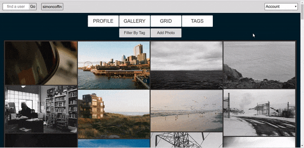
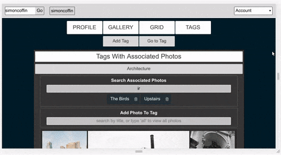
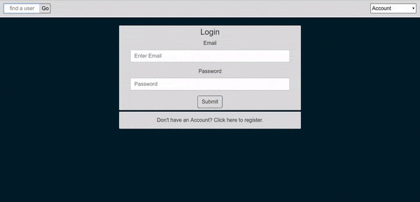

# Visual-Portfolio-Platform

-------------------------------------------------------------------

A simple portfolio platform for still image artists and designers. Searching and sorting is made easy and beautiful for both creators and their audiences.

You can stack filter images with unlimited tags to create target galleries. Dynamically defined routes means your navigation always correlates with your content. Routes are stable and can be entered directly via the browser or refreshed.

Content can be created, edited, and deleted with immediate effect across four display options.

-------------------------------------------------------------------

Use tags to search and sort photos across multiple display options:

A parallel user interface makes navigation easy whether logged in or out:

Dynamic display adapts to all screen sizes:

It only takes seconds to register and start adding content:

-------------------------------------------------------------------

Thanks to:

Coding for Entrepreneurs and their Reactify-Django project for providing some insight into structuring the API: https://github.com/codingforentrepreneurs/Reactify-Django

Traversy Media and his very helpful tutorials:
https://www.traversymedia.com/

Sandra for an incredible masonry photo gallery:
https://github.com/neptunian/react-photo-gallery

-------------------------------------------------------------------

Libaries / Frameworks:

Django, Django Rest Framework, React, React Router, Redux
